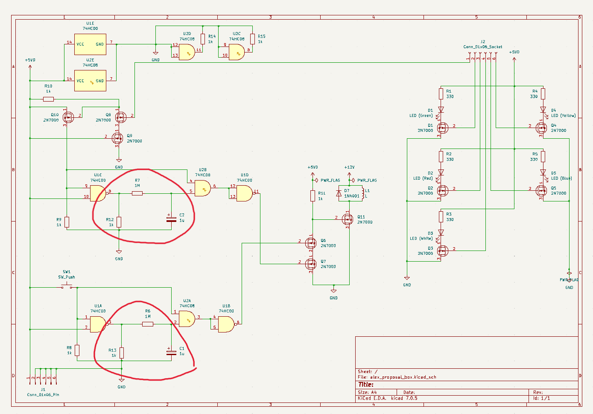

# Proposal Box

## Purpose

Create a hardware interface for the Raspberry Pi to enable toggling of 5 LEDs of different colors, some DC fans, and a 12V solenoid. 

## Demo

## Board Layout

## Design Decisions

### Using subprocess to drive Raspberry Pi GPIO outputs LOW

I noticed some strange behavior when running an older version of `gpio_driver.py` when I did not have the `subprocess` module imported. When I would `CTRL+C` exit from the program, all of the GPIO outputs would drive high - resulting in charging the capacitor for the solenoid & driving all of the LED outputs high. To me, this was undesired behavior because I didn't want the bright LEDs to be on unless the "proposal program" was actively running. 

The best reasoning for why this happened was found on the Raspberry Pi Stack Exchange (https://raspberrypi.stackexchange.com/questions/121081/leds-do-not-turn-off-after-the-raspberry-pi-powers-down#:~:text=If%20you%20want%20to%20make%20sure%20all%20pins,%28set%20all%20pins%20to%20output%20and%20drive%20low%29.) where they reasoned that the operating system does this by default - this seems strange to me because the Pi could potentially have a short circuit and burn out the pins if it leaves them high.

Anyway, my solution to this was to use `subprocess` and the `raspi-gpio` script as suggested in the thread to force the outputs low. However, this results in a GPIO warning the next time `gpio_driver.py` is launched. To get around this, I just ignored the GPIO warnings.

### Push-button solenoid trigger and the one second trigger time

The two circled regions of the schematic show the RC timing circuit that keeps the pulse active. I chose to go for a time constant of 1s to enable the triggered pulse from either the Raspberry Pi or the manual switch two drive the output of the solenoid high. I decided to do this mainly for safety, but the one second was arbitrary. I observed that if the solenoid was kept in an active state for a prolonged period of time, it would begin to heat up (as well as Q11 in the schematic). To limit the dissipated power between 12V and ground, I decided to implement logic to allow for the solenoid to only trigger for 1 second at a time.

The drawback of this is that you must wait for C1 and C2 to charge back up before triggering the solenoid again. Theoretically, this should be at most one second as well, but I've observed that it is better to give it ~3 seconds to fully charge. 

## Future Work

### Printing a PCB

This would be a fun opportunity to learn more about KiCad. They have a good basic tutorial here (https://docs.kicad.org/7.0/en/getting_started_in_kicad/getting_started_in_kicad.html) which was helpful to start playing with the PCB. Soldering the prototype board was a huge PITA and I was worried that I was going to mess something up. 

One area I'd have to fix with the current KiCad files that are in this folder is the footprint for some of the components are off. I was just curious what the board layout would look like, but I would have to get the footprint for the resistors, capacitors, and pin headers to match up with what I have. It would be even better if I could match the Raspberry Pi footprint to effectively create a Raspberry Pi hat. 

### Implement the Cmd library for gpio_driver.py
